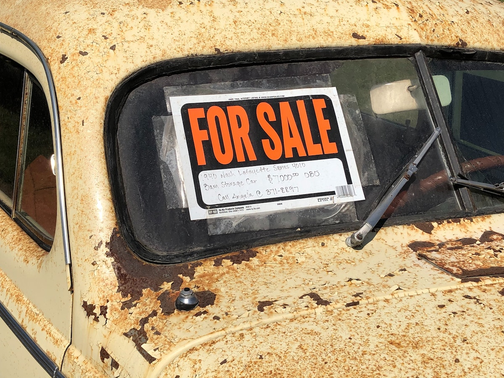
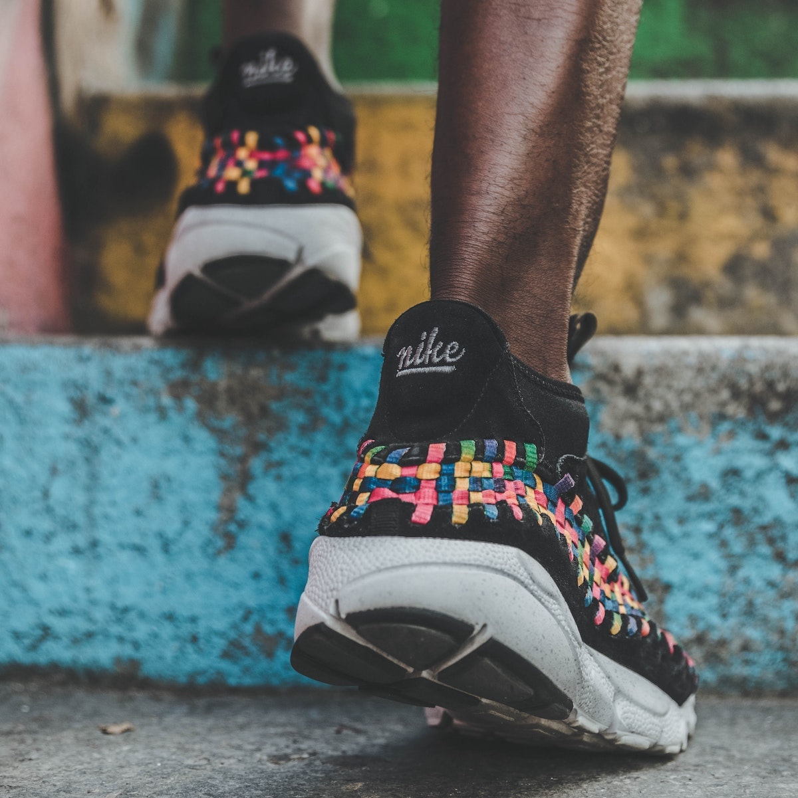

```{r setup, include=FALSE}
usethis::use_git_ignore(c("*.csv", "*.rds"))
options(htmltools.dir.version = FALSE)

library(knitr)
library(tidyverse)
library(xaringan)
library(fontawesome)
```

class: inverse, center, middle

# `r fa("far fa-images", fill = "#fff")`

**View the slides:** 

[bretsw.com/eme6356-su25-module7](https://bretsw.com/eme6356-su25-module7)

---

class: inverse, center, middle

# `r fa("fas fa-comments", fill = "#fff")` <br><br> Looking Back at Module 6

---

# `r fa("fas fa-comments", fill = "#fff")` Ethics of Measurement

```{r, out.width = "480px", echo = FALSE, fig.align = "center"}
include_graphics("img/data.jpg")
```

--

- How accurate are the collected data?

--

- How good are the predictions of complex human behavior?

--

- How well does a measure represent real learning or performance?

---

# `r fa("fas fa-comments", fill = "#fff")` Ethics of Collection

```{r, out.width = "480px", echo = FALSE, fig.align = "center"}

```

--

- Do users have the right to opt in or opt out?

--

- What are the risks of the collected data becoming public?

--

- Who owns the collected data? Who owns where the data are stored?

---

# `r fa("fas fa-comments", fill = "#fff")` Ethics of Analysis

```{r, out.width = "480px", echo = FALSE, fig.align = "center"}
include_graphics("img/tools.jpg")
```

--

- What biases exist in algorithms?

--

- What factors are included or excluded in predictive modeling?

--

- Do users have the right to know and inspect what analyses have been conducted?

---

# `r fa("fas fa-comments", fill = "#fff")` Ethics of Reporting

```{r, out.width = "480px", echo = FALSE, fig.align = "center"}

```

--

- How anonymous are users really? How easily can de-identification be done?

--

- How do truth and trust exist in relationship and in tension with each other?

---

# `r fa("fas fa-comments", fill = "#fff")` Recommended Solutions

```{r, out.width = "480px", echo = FALSE, fig.align = "center"}
include_graphics("img/relax.jpg")
```

--

- **Do no harm!** Operate in the best interests of users (e.g., students)

--

- **Transparency:** Be clear about the purposes for the data

--

- **Data literacy:** Educate users on data collection and privacy issues

---

class: inverse, center, middle

# `r fa("fas fa-question", fill = "#fff")` <br><br> Module 6 <br> Final Thoughts?

---

class: inverse, center, middle

# `r fa("fas fa-rocket", fill = "#fff")` <br><br> The Future


---
class: inverse, center, middle

#  `r fa("fas fa-rocket", fill = "#fff")` <br><br> Future Challenge \#1: <br> **"Participant" "Rights"**

---

# `r fa("fas fa-rocket", fill = "#fff")` Privacy

```{r, out.width = "600px", echo = FALSE, fig.align = "center"}

```

--

- What rights to live and behave from observation?

--

- Opt-in, or opt-out?

---

# `r fa("fas fa-rocket", fill = "#fff")` Openness and Societal Benefit

```{r, out.width = "600px", echo = FALSE, fig.align = "center"}

```

--

- Example: Traffic data

--

  - Looking at aggregate or individual?

---

# `r fa("fas fa-rocket", fill = "#fff")` Data Accessibility

```{r, out.width = "600px", echo = FALSE, fig.align = "center"}

```

--

- Who has access? Who gives feedback? Who benefits?

---

# `r fa("fas fa-rocket", fill = "#fff")` Ownership

```{r, out.width = "600px", echo = FALSE, fig.align = "center"}

```

--

- Who **controls** my data?

--

- Who **profits** from it?

---

# `r fa("fas fa-rocket", fill = "#fff")` Agency

```{r, out.width = "420px", echo = FALSE, fig.align = "center"}

```

--

- How much initiative can be expected?

--

- How does the need to be purposeful fall unevenly?


---

class: inverse, center, middle

#  `r fa("fas fa-rocket", fill = "#fff")` <br><br> Future Challenge \#2: <br> **Ethical Use of Data**

---

# `r fa("fas fa-rocket", fill = "#fff")` Consent

```{r, out.width = "600px", echo = FALSE, fig.align = "center"}

```

--

- Should we ask people for consent to observe them?

--

- What are their expectations for being in public?

--

- What is ok to collect? What forms of analysis are ethical?

---

# `r fa("fas fa-rocket", fill = "#fff")` Transparency

```{r, out.width = "600px", echo = FALSE, fig.align = "center"}

```

--

- Those who collect data should be open about when collecting or observing

--

- Analysis should be open as well

---

# `r fa("fas fa-rocket", fill = "#fff")` Regulation

```{r, out.width = "600px", echo = FALSE, fig.align = "center"}

```

--

- Transparency is not enough: need regulation or moderation

--

- Peer/community review, government oversight, etc.


---

class: inverse, center, middle

#  `r fa("fas fa-rocket", fill = "#fff")` <br><br> Future Challenge \#3: <br> **Real Impact**

---

# `r fa("fas fa-rocket", fill = "#fff")` Learning and Performance

```{r, out.width = "600px", echo = FALSE, fig.align = "center"}

```

--

- Is "learning" simply the vocabulary on a grocery list?

---

# `r fa("fas fa-rocket", fill = "#fff")` Evidence for Conclusions

```{r, out.width = "600px", echo = FALSE, fig.align = "center"}

```

--

- Can't speak to motivations or answer "Why?"

--

- Statistical significance vs. practical significance: mean of 69% vs 76%

---

# `r fa("fas fa-rocket", fill = "#fff")` Challenges in Deployment

```{r, out.width = "600px", echo = FALSE, fig.align = "center"}

```

--

- Development time, support needed, rapid innovation

--

- Need to view as a system

---

# `r fa("fas fa-rocket", fill = "#fff")` Teaching/Training

```{r, out.width = "600px", echo = FALSE, fig.align = "center"}

```

--

- Feedback needs to immediate, clear, and actionable

--

- Give **teachers/instructors** a voice in identifying key performance indicators

---

# `r fa("fas fa-rocket", fill = "#fff")` Feedback and Performance

```{r, out.width = "600px", echo = FALSE, fig.align = "center"}

```

--

- Feedback needs to immediate, clear, and actionable (e.g., adaptive learning)

--

- Give **students/learners** options for filtering analyses

---

# `r fa("fas fa-rocket", fill = "#fff")` Impact on Institutions

```{r, out.width = "720px", echo = FALSE, fig.align = "center"}

```

--

- Should benefit to institutions be primary or secondary?


---

class: inverse, center, middle

#  `r fa("fas fa-rocket", fill = "#fff")` <br><br> Future Challenge \#4: <br> **Only 2 Kinds of Dances**

---

# `r fa("fas fa-rocket", fill = "#fff")` The Humans Are Dead?

<p align="center">
<iframe width="720" height="480" src="https://www.youtube.com/embed/hUnibKe_o18" title="YouTube video player" frameborder="0" allow="accelerometer; autoplay; clipboard-write; encrypted-media; gyroscope; picture-in-picture; web-share" allowfullscreen></iframe>
</p>

---

# `r fa("fas fa-rocket", fill = "#fff")` Robots Replacing Teachers?

```{r, out.width = "100%", echo = FALSE, fig.align = "center"}

```

---

# `r fa("fas fa-rocket", fill = "#fff")` AI Giving an Extra Nudge

```{r, out.width = "100%", echo = FALSE, fig.align = "center"}
include_graphics("img/bike-machine.jpg")
```

---

# `r fa("fas fa-rocket", fill = "#fff")` AI Insight

What are the most important issues in educational data science in the next 5 years? (**According to [Claude.ai](https://claude.ai/) on 4/4/25:**)

```{r, out.width = "320px", echo = FALSE, fig.align = "center"}

```

--

- **Privacy and ethical use of student data:** balancing analytical benefits with strong privacy protections

--

- **Equity in algorithmic decision-making:** ensuring that predictive models and recommendation systems don't perpetuate or amplify existing educational disparities

--

- **Integration of multimodal learning data:** moving beyond just clickstream data to incorporate audio, video, physical interactions, and emotional states

---

# `r fa("fas fa-rocket", fill = "#fff")` AI Insight

What are the most important issues in educational data science in the next 5 years? (**According to [Claude.ai](https://claude.ai/) on 4/4/25:**)

```{r, out.width = "320px", echo = FALSE, fig.align = "center"}

```

- **Interpretable AI for educator:** developing systems that provide actionable insights that teachers

--

- **Measuring learning beyond traditional assessments:** creating frameworks that capture deeper learning, social-emotional growth, and 21st-century skills

---

# `r fa("fas fa-rocket", fill = "#fff")` AI Insight

What are the most important issues in educational data science in the next 5 years? (**According to [Claude.ai](https://claude.ai/) on 4/4/25:**)

```{r, out.width = "320px", echo = FALSE, fig.align = "center"}

```

- **Real-time intervention capabilities:** shifting from retrospective analysis to systems that can identify struggles and provide support during the learning process itself

--

- **Cross-context data integration:** connecting learning across formal education, workplace training, and self-directed learning to support lifelong learning pathways


---

class: inverse, center, top

# `r fa("fas fa-rocket", fill = "#fff")` Future of Analytics

```{r, out.width = "450px", echo = FALSE, fig.align = "center"}

```

<div class="caption">
<p>Midjourney AI art prompt: "futuristic African solarpunk scientists" (Nov 2022)</p>
</div>

### What *should* be the role of analytics?

---

class: inverse, center, top

# `r fa("fas fa-rocket", fill = "#fff")` Future of Analytics

```{r, out.width = "720px", echo = FALSE, fig.align = "center"}

```

<div class="caption">
<p>Midjourney AI art prompt: "futuristic African solarpunk scientists" (Jul 2024)</p>
</div>

### What *should* be the role of analytics?

---

class: inverse, center, top

# `r fa("fas fa-rocket", fill = "#fff")` Future of Analytics

```{r, out.width = "720px", echo = FALSE, fig.align = "center"}

```

<div class="caption">
<p>Midjourney AI art prompt: "futuristic African solarpunk scientists" (Jul 2025)</p>
</div>

### What *should* be the role of analytics?

---

class: inverse, center, top

# `r fa("fas fa-rocket", fill = "#fff")` Future of Analytics

```{r, out.width = "720px", echo = FALSE, fig.align = "center"}

```

<div class="caption">
<p>Midjourney AI art prompt: "futuristic African solarpunk scientists" (Jul 2025)</p>
</div>

### What *should* be the role of analytics?


---

class: inverse, center, middle

# `r fa("fas fa-binoculars", fill = "#fff")` <br><br> Looking ahead

---

# `r fa("fas fa-calendar-day", fill = "#fff")` Semester schedule

```{r, out.width = "720px", echo = FALSE, fig.align = "center"}
include_graphics("img/across-time.jpg")
```

- **Module 1:** Introduction to Analytics
- **Module 2:** Performance Analytics
- **Module 3:** Learning Analytics
- **Module 4:** Web Analytics
- **Module 5:** Data Visualization
- **Module 6:** Ethics in Learning Analytics
- **Module 7: Future of Analytics**
- **Module 8:** Case Discussions
---

# `r fa("fas fa-calendar-day", fill = "#fff")` Major Assignments

```{r, out.width = "560px", echo = FALSE, fig.align = "center"}
include_graphics("img/build.jpg")
```

### Analytics Assignments - Group Projects (60%)

- Analytics Problem Plan (100 points)
- Analytics Practice (200 points)
- **Analytics Case Presentation (200 points)**
- Analytics Ethics Statement (100 points)

---

# `r fa("fas fa-calendar-day", fill = "#fff")` Major Assignments

```{r, out.width = "560px", echo = FALSE, fig.align = "center"}
include_graphics("img/build.jpg")
```

### Analytics Case Presentation (200 pts) - **due end of Module 7**

--

- With your usual project team, further explore your topic

--

- Create a slide deck to share your case and present in class

--

- The goal is to prompt discussions in Module 8 to wrap up the semester

---

class: inverse, center, middle

# `r fa("fas fa-question", fill = "#fff")` <br><br> Questions

<hr>

**What questions can I answer for you now?**

**How can I support you this week?**

<hr>

`r fa("envelope", fill = "#fff")` [bret.staudtwillet@fsu.edu](mailto:bret.staudtwillet@fsu.edu) | `r fa("globe", fill = "#fff")` [bretsw.com](https://bretsw.com) | `r fa("fab fa-github", fill = "#fff")` [GitHub](https://github.com/bretsw/)

---

class: inverse, center, middle

# Learn to Code

```{r, out.width = "320px", echo = FALSE, fig.align = "center"}
include_graphics("img/dsieur.jpg")
```

**https://datascienceineducation.com/**

---

class: inverse, center, middle

# `r fa("fas fa-otter", fill = "#fff")` <br><br> Play in the <br> [Analytics Sandbox](https://bretsw.com/sandbox)

`r fa("fab fa-github", fill = "#fff")` [GitHub repository for code and data](https://github.com/bretsw/sandbox)

`r fa("fas fa-cubes-stacked", fill = "#fff")` [Datasets for practice](https://bretsw.com/post/datasets/)
